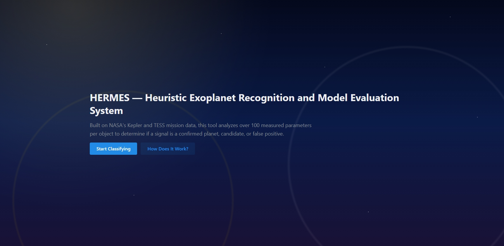

# HERMES
<p align="center">
  
</p>
HERMES is a web application designed for the **NASA Space Apps Challenge**, helping users classify exoplanet candidates efficiently. It allows users to upload or edit exoplanet datasets and run a machine learning model to identify **confirmed planets**, **potential candidates**, or **false positives**.

Beyond predictions, HERMES delivers **interactive analytics** to reveal which features most influence decision-making — making complex astronomical insights both accessible and actionable.

---

## 🚀 Features

- **Exoplanet Classification Engine** — ML-powered prediction of candidate status  
- **Dataset Upload & Editing** — Bring your own CSV or refine existing NASA datasets  
- **Interactive Visual Analytics** — Understand feature importance and decision rationale  
- **Manual Model Retraining** — Experiment with new data without touching the code  
- **Web-Based Interface** — No setup required beyond a browser

---

## 📸 Screenshots & Demo

<p align="center">
  
<br>Home Page
</p>
<br>
<p align="center">
  
<br>Single Classification Page
</p>
<br>
<p align="center">
  
<br>Bulk Classification Page
</p>

**🎥 Live Demo / GIF:** [**Drive Link**](https://drive.google.com/file/d/1nnsOZc7g-GDML8YPbKS4zJvAVotpEYyU/view?usp=sharing)

---

## 🛠 Tech Stack

**Development Tools:** Github, Visual Studio Code, Postman, Kaggle
**Languages:** JavaScript, Python, SQL
**Frameworks / Libraries:** Mantine, Next.js, React.js, FastAPI, scikit-learn, XGBoost, SHAP

**Machine Learning Notebook:**
🔗 https://www.kaggle.com/code/benedicklabbao/nasa-space-apps-challenge-2025

---

## 📦 Installation

```bash
# Clone the repository
git clone https://github.com/YOUR_USERNAME/HERMES.git
cd HERMES

# --- Backend Setup ---
cd backend

# (Optional but recommended) Create virtual environment
python -m venv venv
source ./venv/bin/activate  # On Windows: venv\Scripts\activate

# Install Python dependencies
pip install -r requirements.txt

# Start backend server
export PYTHONPATH=./src/     # On Windows: set PYTHONPATH=./src/
uvicorn main:app --port 8000 --reload

# --- Frontend Setup (in a new terminal) ---
cd ../frontend
npm install
npm run dev
